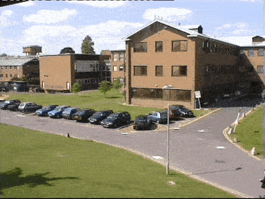
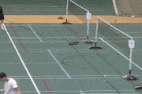
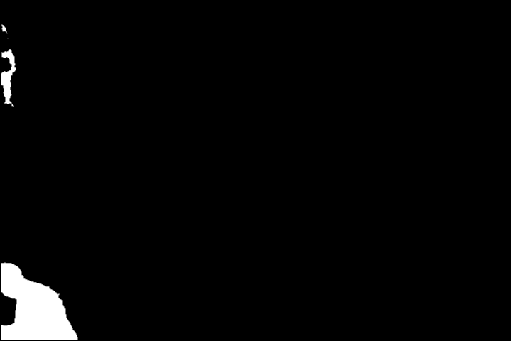

# Advanced Background Subtraction

Advanced Background Subtraction, part of an assignment for course COL780 2021 taken by Prof. Chetan Arora.

A few different datasets were provided with some specific background and scene assumptions. For each of the dataset, methods were devised to effectively handle the specific challenges implied by the assumptions.

### Cars Dataset

    
    

### Illumination changes dataset

    
    

### Jitter Tennis dataset

    
    

